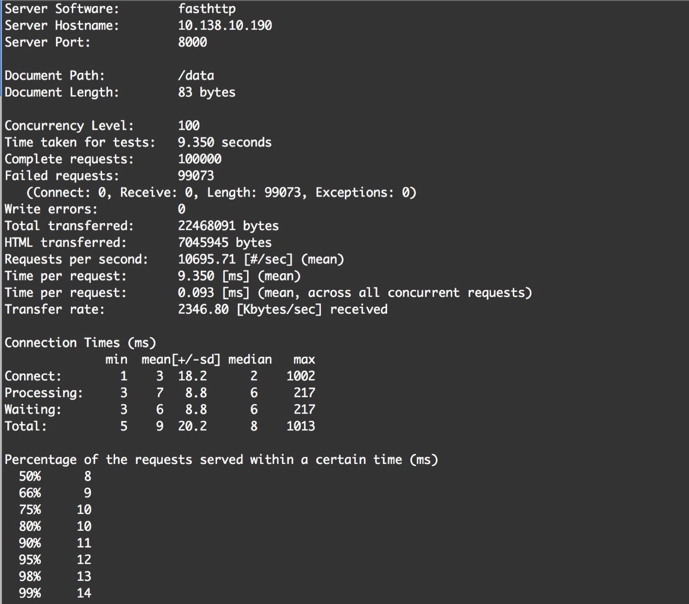
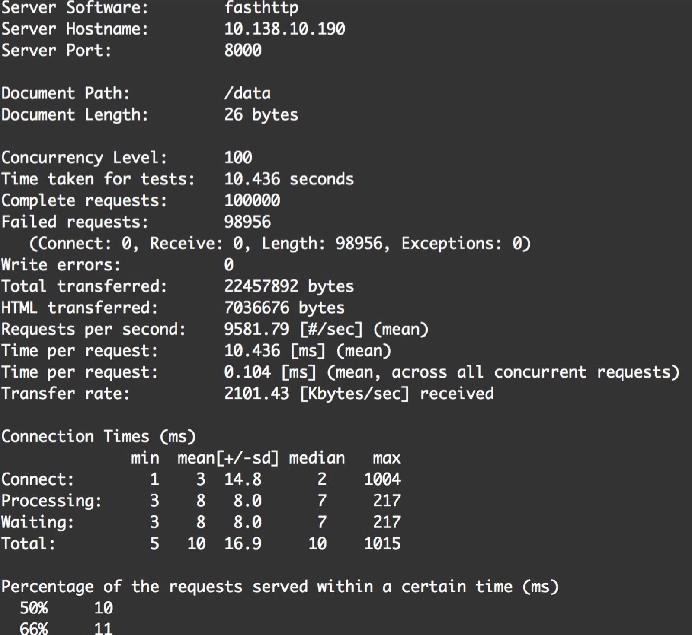

grpc && fasthttp benchmark
==========================

### backend

  http && rpc 服务

  http 监听 8080
  rpc 监听 9090

  http和rpc均调用同一个简单函数，此函数代表实际业务: 随机返回一个json数据。

### front

  对外提供http服务, http接口 'http://xxx/data'。

  假设 backend 运行在1.2.3.4机器上.

  启动方式: 

    front --access=[http/grpc] --http_backend=http://1.2.3.4:8080 --rpc_backend=1.2.3.4:9090

### 压测数据

    ab -n 100000 -c 100 http://front/data

#### grpc调用方式

#### http调用方式

